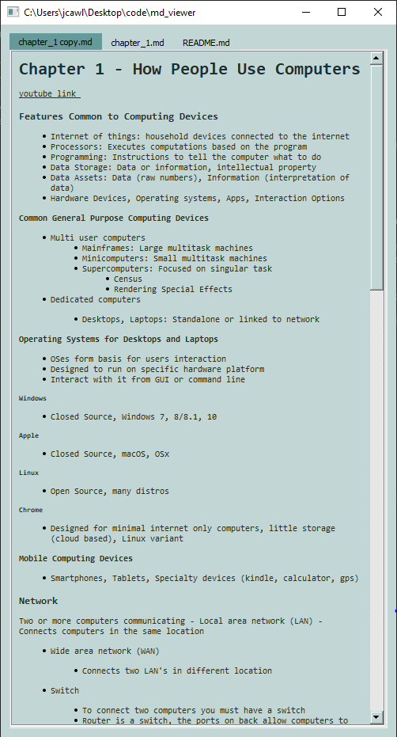

## quickly view folder of notes written in markdown
#### install all requirments
`> pip install r- requirements.txt`

#### Pass path to folder as first and only argument (absolute or relative path)
`> python main.py ../../Desktop`

#### create alias for python <path to file>
`> md_view C:\Users\jake\Desktop\Notes\CompSci`
#
`> md_view ../../Users`

